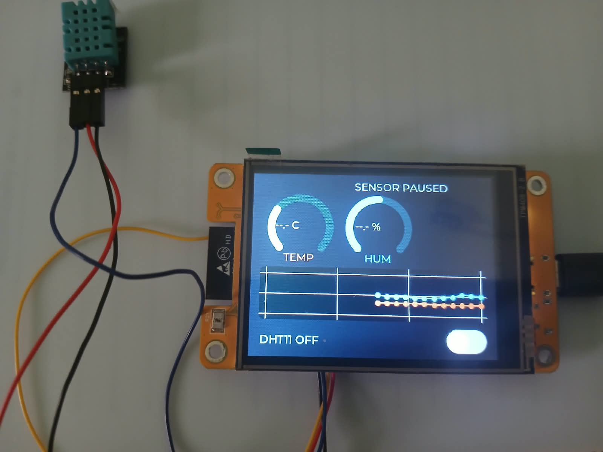

# Smart Agritech Greenhouse Monitor

A touch-controlled greenhouse dashboard for the ESP32-2432S028 CYD. It reads temperature and humidity from a DHT11 sensor and displays live gauges, historical trends, and a high-temperature warning.

## Demo

### Live sensor readings



### Sensor paused


## Features

- ST7789 2.8-inch CYD display with LVGL.
- XPT2046 touch controls.
- DHT11 temperature and humidity readings.
- FreeRTOS dual-core architecture:
  - DHT11 task pinned to Core 0.
  - LVGL task pinned to Core 1.
- Zero-wait mutex handoff between sensor and UI tasks.
- Temperature and humidity circular gauges.
- Live line chart with a new point every two seconds.
- Touch switch to pause or resume DHT11 readings.
- Critical red warning when temperature exceeds 35 C.

## Hardware

- ESP32-2432S028 CYD with TPM408-2.8 display
- HC-SR501 PIR was used during early tests; the current application uses a DHT11
- DHT11 sensor module
- Breadboard and jumper wires

## DHT11 wiring

| DHT11 pin | ESP32-CYD |
| --- | --- |
| VCC | 3.3V |
| GND | GND |
| DATA | GPIO22 |

Use a 4.7k-10k pull-up resistor between DATA and 3.3V if your DHT11 module does not already include one.

## CYD display and touch pins

| Function | GPIO |
| --- | ---: |
| TFT SCLK / MOSI / MISO | 14 / 13 / 12 |
| TFT DC / CS | 2 / 15 |
| TFT backlight | 21 |
| XPT2046 touch SCLK / MOSI / MISO | 25 / 32 / 39 |
| XPT2046 touch CS | 33 |

The display uses the ST7789 driver at 20 MHz. The XPT2046 touch controller uses the CYD software-SPI configuration required by this board revision.

## Build and upload

1. Open the project in VS Code with PlatformIO.
2. Connect the CYD board by USB-C.
3. Run **Build**.
4. Run **Upload**.
5. Allow the DHT11 to settle, then use the touch switch to pause or resume readings.

## Project structure

```text
src/main.cpp       Firmware, display driver, LVGL UI, and FreeRTOS tasks
include/lv_conf.h  LVGL widget configuration
platformio.ini     PlatformIO environment and dependencies
images/            Hardware and dashboard screenshots
```

## Known limitations

- DHT11 readings are relatively slow and should not be sampled faster than about two seconds.
- The chart uses one shared 0-100 scale for temperature and humidity.
- The current version has no Wi-Fi or cloud logging.

## License

This project is available under the MIT License.
